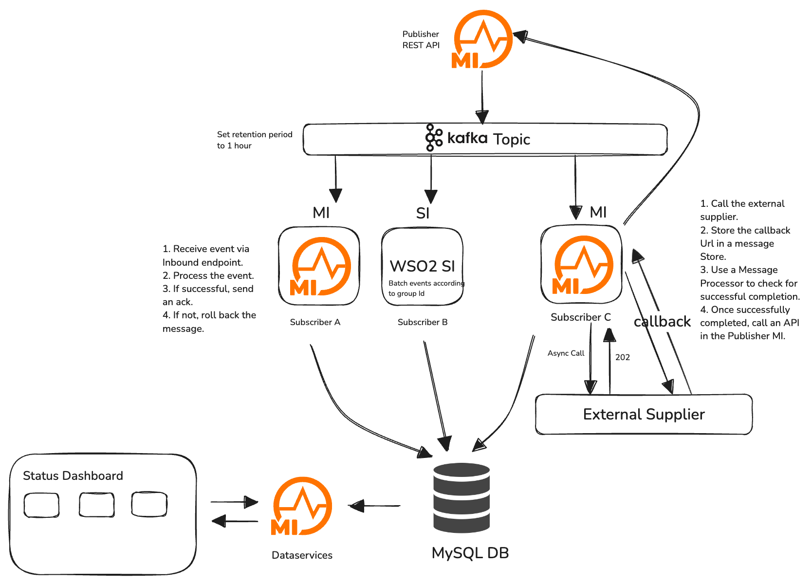

## Overview

This project demonstrates how to implement Event drive Integration with WSO2 Micro Integrator, WSO2 Streaming Integrator and Apache Kafka. The project consists of a Publisher API that publishes orders to a Kafka topic, and three subscribers that subscribe to the Kafka topic and process the orders. The project also demonstrates how to call an external API from the subscriber and acknowledge the order to the publisher based on the response from the external API.



## How to Run

### Prerequisites

- [Docker](https://docs.docker.com/get-docker/)
- [Docker Compose](https://docs.docker.com/compose/install/)
- [MI VSCode Extension](https://marketplace.visualstudio.com/items?itemName=wso2.micro-integrator)

### Steps

1. Clone the repository.
2. Run the following command to start containers.
    ```bash
    docker-compose  up
    ```
3. Visit `http://localhost:3000` to access the status dashboard.
4. Publish an event to the Publisher API. 
    ```bash
    curl -X POST "http://localhost:8290/orders" -H "Content-Type: application/json" -d '{"orderId":"12345","customerId":"98765","items":["router"],"eventGroup":"order_12345"}'
    ```
5. You can view the status of the Subscribers in the status dashboard.

## Project Structure

The project has the following structure:


### Description of Key Directories and Files

- **micro-integrator/AsyncAPIIntegration/**: This contains the Integration project. This can be opened with Micro Integrator VSCode extension.
  - Orders Publisher API - This is the API that publishes the orders to the Kafka topic.
    Sample curl command to publish an order:
    ```bash
    curl -X POST "http://localhost:8290/orders" -H "Content-Type: application/json" -d {"orderId":"12345","customerId":"98765","items":["router"],"eventGroup":"order_12345"}'
    ```
  - SubscriberA Inbound Endpoint - This is the Subscriber A that subscribes to the Kafka topic and processes the orders. Currently, it just logs the orders.
    - Sequences
        - SubscriberA_seq_process - The main sequence that gets triggered when an order is received.
        - SubscriberA_seq_fault - The fault sequence that gets triggered when an error occurs.
  - SubcriberC Inbound Endpoint - This is the Subscriber C that subscribes to the Kafka topic and sends the orders to the ExternalSupplier API. The response is stored in the `SupplierStateStore` message store
    - Sequences
        - SubscriberC_seq_process - The main sequence that gets triggered when an order is received.
        - SubscriberC_seq_fault - The fault sequence that gets triggered when an error occurs.
  - SupplierStateStore - This is the message store that stores the callback url from the ExternalSupplier API.
  - CheckStatusProcessor - This is the message processor that reads the callbackUrl from the `SupplierStateStore` message store and call the External Supplier Status API. If the response is success, it will acknowledge the order to the publisher. Or else it will retry until it gets a success response.
    - StatusCompletedSeq - This is the sequence that gets triggered when the message processor successfully gets a response from the External Supplier Status API.
    - StatusFailedSeq - This is the sequence that gets triggered when the message processor fails to get a response from the External Supplier Status API.

  - ExternalSupplierAPI - This is the API that simulates the External Supplier API. It receives the order from the SubscriberC and returns a response with a callback Url.
  - ExternalSupplierCallbackAPI - This is the API that simulates the External Supplier Callback API. It returns a random response with a success or failure status.

  - PublisherAcknowledgeAPI - This is the API that simulates the Publisher Acknowledge API. The `StatusCompletedSeq` sequence calls this API to acknowledge the order to the publisher.

- **micro-integrator/**: Micro Integrator configurations.
  - **libs/**: It has the required libraries for the Micro Integrator to connect with Kafka.
- **Readme.md**: Project documentation.
- **SiddhiApps/**: Siddhi applications.
    - **jars** - Kafka jars needed to be added to the Stream Integrator libs.
  - **siddhi-files/SubscriberB.siddhi**: Subscriber B Siddhi application that subscribes to the Kafka topic and processes the orders. It batches the orders and logs them.